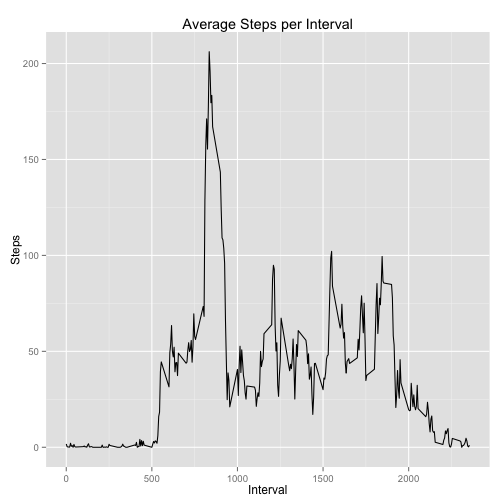
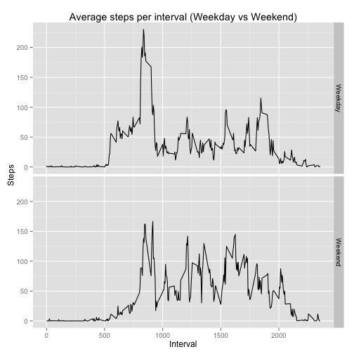

# Reproducible Research: Peer Assessment 1


## Loading and preprocessing the data

```r
unzip("activity.zip")

data.activity <- read.csv("activity.csv", header = T, sep = ",")
```

## What is mean total number of steps taken per day?

```r
data.activity.complete <- data.activity[complete.cases(data.activity),]

GetTotalStepsPerDay <- function(data) {
    data.per.day <- aggregate(data$steps, list(Date = data$date), FUN = sum)
    names(data.per.day) <- c("Date", "Steps")
    data.per.day
}

data.steps.per.day <- GetTotalStepsPerDay(data.activity.complete)

hist(data.steps.per.day$Steps, main = "Total number of steps taken per day",
     xlab = "Total number o steps")
```

 


```r
data.steps.mean <- mean(data.steps.per.day$Steps)

data.steps.median <- median(data.steps.per.day$Steps)
```
**Mean** total number of steps per day is **10766**.

**Median** total number of steps per day is **10765**.


## What is the average daily activity pattern?

```r
library(ggplot2)

data.steps.avg.interval <- aggregate(data.activity.complete$steps,
    list(Interval = data.activity.complete$interval), FUN = mean)

names(data.steps.avg.interval) <- c("Interval", "Steps")

qplot(Interval, Steps, data = data.steps.avg.interval, geom = "line",
    main = "Average Steps per Interval")
```

 


```r
data.steps.max.interval <- data.steps.avg.interval[data.steps.avg.interval$Steps == max(data.steps.avg.interval$Steps),1]
```
The interval **835** on average contains the maximum number of steps across all days.

## Imputing missing values

There are **2304** rows having missing values in the dataset.

Let's see if we impute the missing values with the mean of the 5-minute interval, how the histogram and mean/median values might be impacted.


```r
# Create a new copy
data.activity.imputed <- data.activity

# Merge it with mean of the 5-minute interval
data.activity.imputed <- merge(data.activity.imputed, data.steps.avg.interval,
                               by.x = "interval", by.y = "Interval", all.y = T)

# Update the NA with the mean of 5-minute interval
data.activity.imputed <- within(data.activity.imputed, {
    steps <- ifelse(is.na(steps), Steps, steps)
})

# Remove extra mean Steps column
data.activity.imputed <- data.activity.imputed[, 1:3]

data.steps.per.day.imputed <- GetTotalStepsPerDay(data.activity.imputed)

hist(data.steps.per.day.imputed$Steps,
     main = "Total number of steps taken per day after imputing missing value",
     xlab = "Total number of steps")
```

 


**Mean** total number of steps per day now is **10766**.

**Median** total number of steps per day now is **10766**.

Based on the re-calculated value, it seems imputing the missing value doesn't affect the mean & median calculated.

## Are there differences in activity patterns between weekdays and weekends?

```r
WeekdayCategory <- function(date.string) {
    weekday <- weekdays(as.Date(date.string, "%Y-%m-%d"), abbreviate = T)
    ifelse(weekday == "Sun" | weekday == "Sat", "Weekend", "Weekday")
}

data.activity.imputed$Weekday <- WeekdayCategory(as.character(data.activity.imputed$date))

data.steps.weekday.interval <- aggregate(data.activity.imputed$steps,
    list(Interval = data.activity.imputed$interval, Weekday = data.activity.imputed$Weekday),
    FUN = mean)

names(data.steps.weekday.interval) <- c("Interval", "Weekday", "Steps")

qplot(Interval, Steps, data = data.steps.weekday.interval, facets = Weekday ~ ., geom = "line",
      main = "Average steps per interval (Weekday vs Weekend)")
```

 

As we can observed, the steps patterns reflect normal life as expected.    

During weekday, activities start earlier and most of the activities are mainly around **835** interval which is **8:45AM**.  Other times, the activities are pretty low.  The other bump is around **1800** interval which is **6PM**.

During weekend, activities start later than weekday.  It starts climb up aroud **900** interval which is **9AM**.  During the day, the activities are in quite high level.

Both weekday and weekend activities end around **2200** interval which is **10PM**.  Quite healthy sleeping time.
